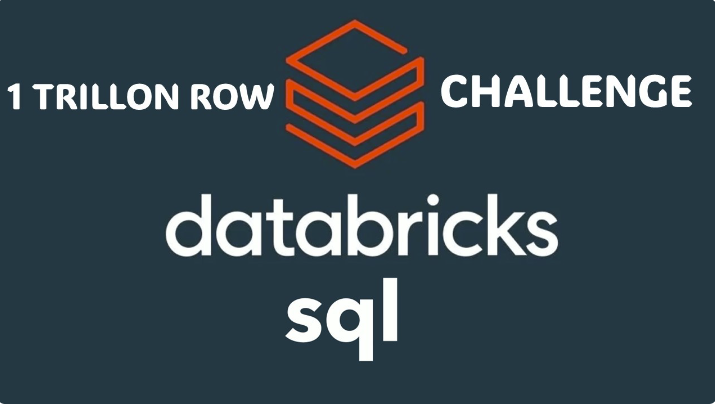
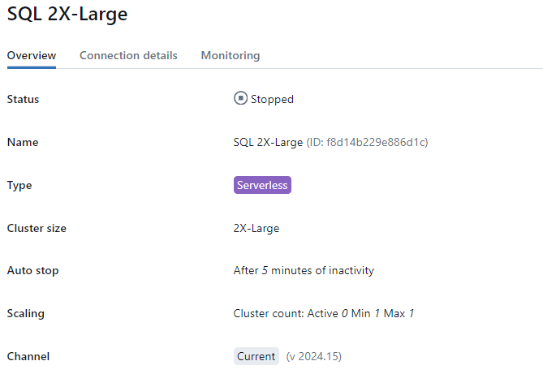

# <h1 align="left">Databricks SQL Serverless 1 TRILLÓN DE FILAS</h1>

👉 En esta ocasión os voy a presentar una demostración basada en el artículo Joe Harris y Andrey Mirskiy empleados de Databricks, que al mismo tiempo estaba basado en otro artículo de Sarah Johnson, donde demostraban los tiempos de carga y manejo de tablas con un trillón de filas. 

✅ He realizado algunos cambios y ajustes para ir un poco más lejos, poniendo un poco más a prueba los Cluster de SQL Serverless de Databricks.

<h3 align="left">1. Configuración de Cluster en Databricks SQL Serverless</h3>

Para esta demostración he usado el siguiente clusters:

📢 No se activó el Scaling en ninguno de los cluster, para tener un control más exahustivo (dentro de lo posible) de los costes que detallaremos más adelante. El auto escalado funciona de la siguiente manera, en caso de que lo actives:

<h4 align="left">¿Cómo funciona el autoscaling?🚀</h4> 

Databricks agrega clústeres en función del tiempo que llevaría procesar todas las consultas actualmente en ejecución, todas las consultas en cola y las consultas entrantes esperadas en los próximos 2 minutos.

- Si son menos de 2 minutos, no aumenta la escala.
- Si son de 2 a 6 minutos, agregua 1 cluster.
- Si son de 6 a 12 minutos, agrega 2 grupos.
- Si son de 12 a 22 minutos, agrega 3 grupos.

De lo contrario, Databricks agrega 3 clústeres más 1 clúster por cada 15 minutos adicionales de carga de consultas esperada.

⏱️ Si la carga es baja durante 15 minutos, Databricks reduce el almacén de SQL. Mantiene suficientes grupos para manejar la carga máxima durante los últimos 15 minutos. Por ejemplo, si la carga máxima fue de 25 consultas simultáneas, Databricks mantiene 3 clústeres.

<h3 align="left">Creación del Catálogo en Databricks</h3>

En esta demo voy a trabajar con Unity Catalog que es una característica de la plataforma de Azure Databricks que le permite administrar y descubrir activos de datos, como tablas y bases de datos, en toda su organización, para más información te dejo este enlace.
